# Настройка среды разработки и первый HTTP-сервер

**Студент:** Лещинский П.А.  
**Группа:** ПИЖ-б-о-25-2(2)  
**Вариант:** 2  
**Технология:** Node.js + Express  
---

## Цель работы

Освоить установку инструментов для бэкенд-разработки, создать и запустить минимальный веб-сервер, обрабатывающий GET-запросы, понять концепцию эндпоинтов, научиться настраивать автоматический перезапуск сервера.

---

## Теоретическое обоснование

Бэкенд – это серверная часть веб-приложения, которая обрабатывает запросы клиентов, взаимодействует с базами данных и формирует ответы. Клиент-серверная архитектура строится на обмене HTTP-запросами и ответами.

Эндпоинт – это конкретный URL с методом HTTP, по которому клиент обращается к серверу. В работе использовался метод GET для получения данных.

JSON – текстовый формат обмена данными, стандарт для REST API.

Express – минималистичный фреймворк для Node.js, упрощающий создание серверов и маршрутизацию.

Для автоматического перезапуска сервера при изменениях кода использовался пакет nodemon.

---

## Выполнение практического примера

Код примера находится в файле:  
[`lab1/node-app/app-example.js`](./node-app/app-example.js)

### Команды для запуска
```bash
cd lab1/node-app
npm run dev-example
```

### Скриншоты

**Корневой маршрут (`/`):**  
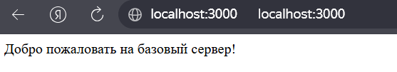

**JSON-эндпоинт (`/api/status`):**  
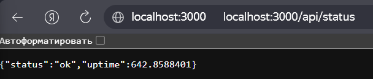

---

## Выполнение индивидуального задания

### Базовый уровень

Код базового уровня:  
[`lab1/node-app/app-basic.js`](./node-app/app-basic.js)

**Эндпоинты:**
- `GET /` – текстовый ответ
- `GET /api/date` – JSON с текущей датой и днём недели

**Скриншоты:**  
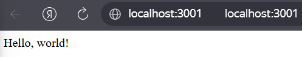  
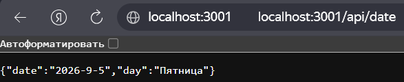

---

### Средний уровень

Код среднего уровня:  
[`lab1/node-app/app-medium.js`](./node-app/app-medium.js)

**Эндпоинты:**
- `GET /` – текстовый ответ
- `GET /api/posts` – список постов
- `GET /api/tags` – список тегов
- Обработчик 404 – возвращает `{"error": "Not Found"}`

**Скриншоты:**  
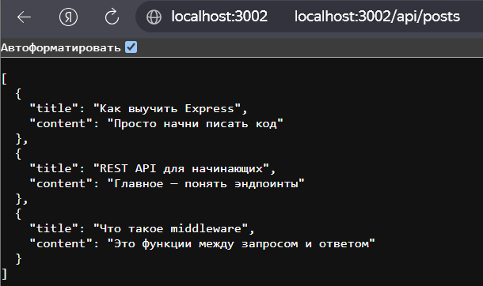  
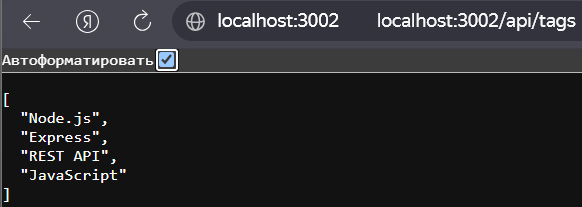  
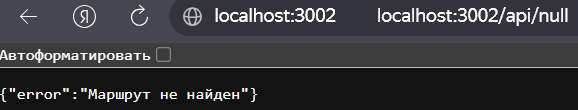

---

### Продвинутый уровень

Код продвинутого уровня:  
[`lab1/node-app/app-advanced.js`](./node-app/app-advanced.js)

**Эндпоинты:**
- `GET /` – текстовый ответ
- `GET /api/users` – список пользователей
- `GET /api/companies` – список компаний
- `GET /api/users/:id` – пользователь по ID
- Обработчик 404
- Логирование всех запросов (метод + URL + время)

**Скриншоты:**  
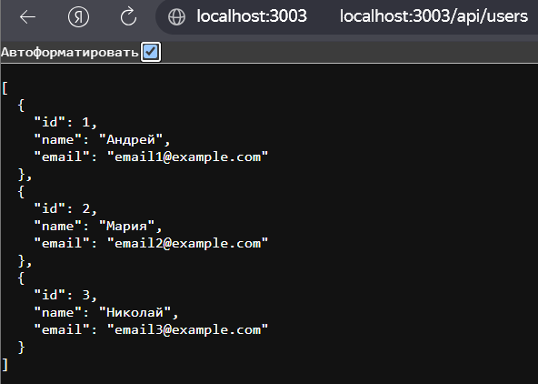  
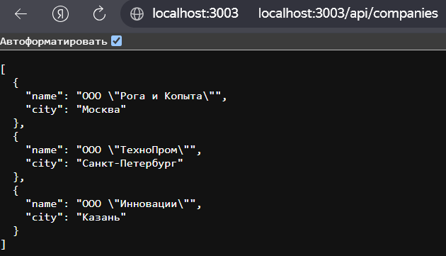  
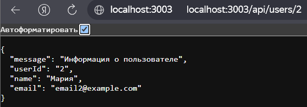  
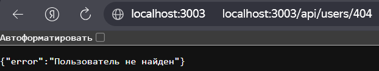  
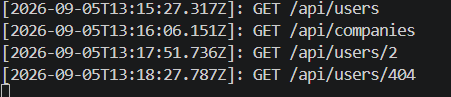

---
## Контрольные вопросы

**1. Что такое клиент-серверная архитектура?**  
Это модель, где клиент (браузер, приложение) отправляет запросы серверу, а сервер их обрабатывает и возвращает ответ.

**2. Какой протокол используется для общения клиента и сервера в вебе?**  
Протокол HTTP.

**3. Что такое эндпоинт (endpoint)?**  
Это URL + метод HTTP, по которому клиент обращается к серверу. Например: `GET /api/users`.

**4. Какую структуру имеет HTTP-запрос и HTTP-ответ? Что такое код состояния (status code)?**  
Запрос: метод, URL, заголовки, тело. Ответ: код состояния, заголовки, тело.

**5. Что такое JSON? Почему он популярен в веб-разработке?**  
JSON – текстовый формат обмена данными. Популярен, потому что лёгкий, читаемый и легко парсится в любом языке программирования.

**6. Как запустить сервер на Node.js или Flask?**  
Node.js: `node app.js` или `npm run dev` (с nodemon). Flask: `python app.py`.

**7. Что такое автоматический перезапуск сервера и зачем он нужен? Какой пакет используется для Node.js?**  
Это перезапуск сервера при изменении кода, чтобы не делать это вручную. Ускоряет разработку. В Node.js используется пакет `nodemon`.

**8. Какие коды состояния HTTP вы знаете? За что отвечает код 404?**  
200 – OK, 400 – плохой запрос, 401 – не авторизован, 403 – запрещено, 404 – не найдено, 500 – ошибка сервера. 404 означает, что ресурс не существует.

**9. Что такое middleware в Express / декораторы запросов во Flask (для продвинутого уровня)?**  
Middleware – это функции, которые выполняются между запросом и ответом: логирование, проверка авторизации и т.п. Во Flask аналогичную роль играют декораторы `@app.before_request`.

**10. Как получить параметр из URL-пути (например, ID пользователя) в вашем фреймворке?**  
В Express – через `req.params.id`. Во Flask – как аргумент функции: `def get_user(user_id):`.

## Вывод

В ходе работы были изучены основы бэкенд-разработки: установка Node.js, настройка Express, создание эндпоинтов, работа с JSON, логирование запросов и обработка ошибок. Реализованы три уровня сложности: базовый, средний и продвинутый. Освоен автоматический перезапуск через nodemon. Все эндпоинты протестированы в браузере.

---

## Список использованных источников

1. Node.js официальная документация – https://nodejs.org/en/docs/  
2. Express официальная документация – https://expressjs.com/  
3. JavaScript – https://developer.mozilla.org/ru/docs/Web/JavaScript