# Лабораторная работа №3: Маршрутизация, параметры пути и query-параметры

**Студент:** Лещинский П.А.
**Группа:** ПИЖ-б-о-25-2(2)
**Вариант:** 2
**Технология:** Node.js + Express

---

## Цель работы

Освоить различные способы передачи данных через URL. Научиться строить гибкие маршруты с параметрами пути и query-параметрами, комбинировать их, обрабатывать вложенные ресурсы и валидировать входные данные. Понять разницу между `req.params`, `req.query` и `req.body`.

---

## Теоретическое обоснование

**Маршрутизация** — механизм сопоставления HTTP-запроса (метод + URL) с кодом-обработчиком на сервере. В Express маршрут описывается как `app.METHOD(PATH, HANDLER)`, где `METHOD` — HTTP-метод, `PATH` — путь URL (может содержать параметры), `HANDLER` — функция-обработчик.

**Три источника данных в запросе:** параметры пути (`req.params`) — часть URL вида `/users/42`; query-параметры (`req.query`) — пары «ключ=значение» после `?`; тело запроса (`req.body`) — данные POST/PUT/PATCH. Параметры пути и query-параметры всегда приходят строками, поэтому требуется приведение типов и валидация.

**Вложенные маршруты** отражают иерархию ресурсов: один ресурс принадлежит другому. Например, `GET /users/:userId/posts/:postId/comments/:commentId` возвращает комментарий, принадлежащий конкретному посту конкретного пользователя. При этом важна **каскадная валидация**: проверка существования и связей всех сущностей по цепочке.

---

## Описание API

Базовый URL: `http://localhost:3000`

### Сводная таблица эндпоинтов

| Метод | Путь | Описание |
|-------|------|----------|
| GET | `/users` | Список пользователей с фильтрацией, сортировкой, пагинацией |
| GET | `/users/stats` | Статистика по возрасту (count, average, min, max) |
| GET | `/users/:id` | Один пользователь по id |
| GET | `/users/:id/posts` | Посты пользователя |
| GET | `/users/:userId/posts/:postId/comments/:commentId` | Комментарий поста пользователя |
| GET | `/cities/:city/users` | Пользователи города |
| GET | `/cities/:city/users/:userId` | Пользователь в конкретном городе |
| GET | `/companies/:id/users` | Пользователи компании |

### Query-параметры `GET /users`

| Параметр | Тип | Описание | Пример |
|----------|-----|----------|--------|
| `search` | string | Поиск по имени (подстрока, регистронезависимо) | `?search=Андрей` |
| `filter` | string | Фильтр в формате `field:value`. Поля: `city`, `age` | `?filter=city:Москва` |
| `sort` | string | Поле сортировки: `id`, `name`, `age` | `?sort=age` |
| `order` | string | Направление: `asc` (по умолчанию), `desc` | `?order=desc` |
| `page` | integer | Номер страницы (≥ 1, по умолчанию 1) | `?page=2` |
| `limit` | integer | Размер страницы (1–100, по умолчанию 10) | `?limit=5` |

## Структура проекта

```
lab3/
├── app.js                                  # основной файл сервера (Express)
├── package.json                            # описание проекта и зависимости
├── package-lock.json                       # фиксация версий зависимостей
├── Lab3_Routing.postman_collection.json    # коллекция Postman (экспорт)
├── lab3.http                               # коллекция запросов для REST Client (VS Code)
├── README.md                               # отчёт по лабораторной работе
└── screenshots/                            # скриншоты выполнения запросов
    ├── lab3-1.png
    ├── lab3-2.png
    ├── ...
    └── lab3-14.png
```

**Назначение файлов:**

| Файл | Назначение |
|------|-----------|
| `app.js` | Исходный код сервера |
| `package.json` | Метаданные проекта, скрипты, зависимости |
| `lab3.http` | Готовые запросы для VS Code REST Client |
| `screenshots/` | Скриншоты ответов сервера, вставленные в отчёт |

## Скриншоты работы

<details>
<summary><b>lab3-1. GET /users — список всех пользователей</b></summary>

**Запрос:** `GET http://localhost:3000/users`

**Ожидаемый вывод:** `200 OK`, `{ count: 8, users: [...] }`

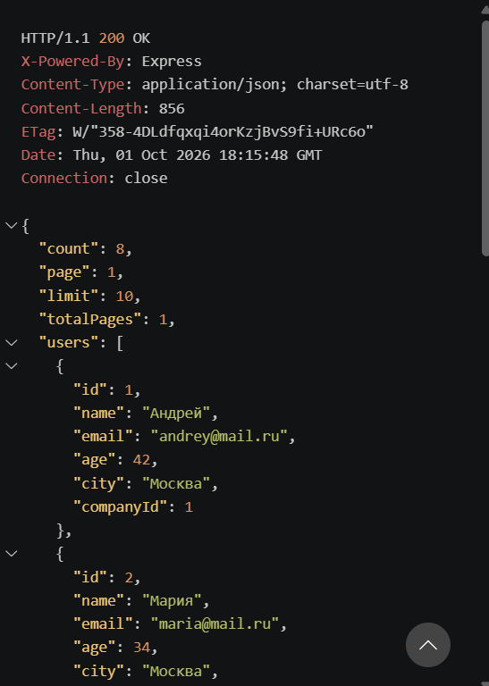

</details>

<details>
<summary><b>lab3-2. GET /users/1 — один пользователь по id</b></summary>

**Запрос:** `GET http://localhost:3000/users/1`

**Ожидаемый вывод:** `200 OK`, объект Андрея

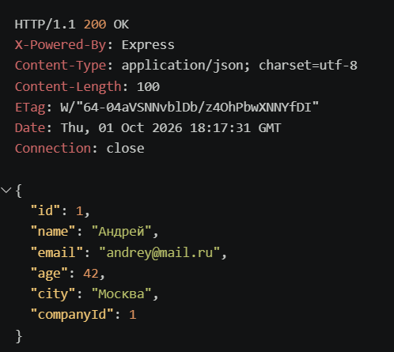

</details>

<details>
<summary><b>lab3-3. GET /users/1/posts — посты пользователя</b></summary>

**Запрос:** `GET http://localhost:3000/users/1/posts`

**Ожидаемый вывод:** `200 OK`, `{ count: 2, posts: [...] }` (посты 1 и 2)

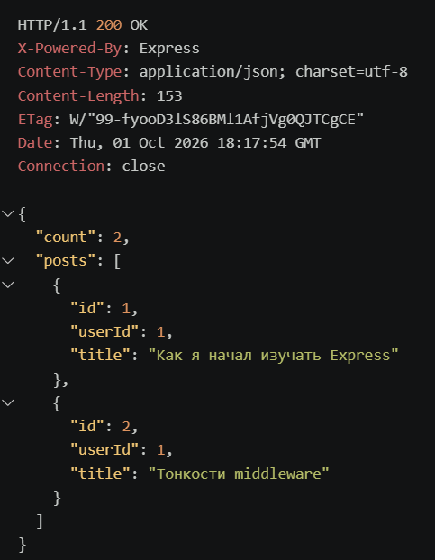

</details>

<details>
<summary><b>lab3-4. GET /users/1/posts/1/comments/1 — множественные параметры пути</b></summary>

**Запрос:** `GET http://localhost:3000/users/1/posts/1/comments/1`

**Ожидаемый вывод:** `200 OK`, `{ user: "Андрей", post: "...", comment: "..." }`

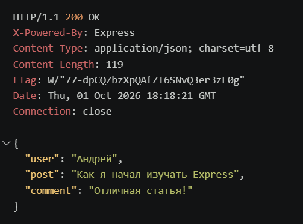

</details>

<details>
<summary><b>lab3-5. GET /users?search=Андрей — поиск по имени</b></summary>

**Запрос:** `GET http://localhost:3000/users?search=Андрей`

**Ожидаемый вывод:** `200 OK`, `count: 1` (только Андрей)

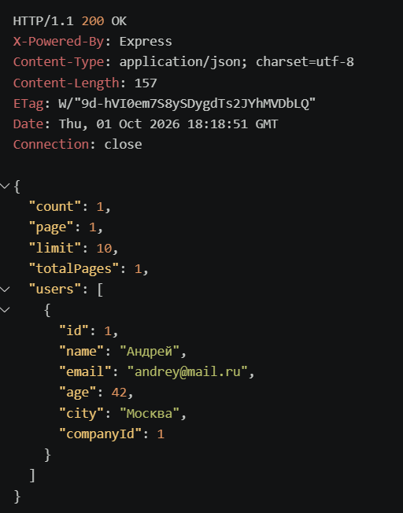

</details>

<details>
<summary><b>lab3-6. GET /users?filter=city:Москва — фильтрация по городу</b></summary>

**Запрос:** `GET http://localhost:3000/users?filter=city:Москва`

**Ожидаемый вывод:** `200 OK`, `count: 3` (Андрей, Мария, Пётр)

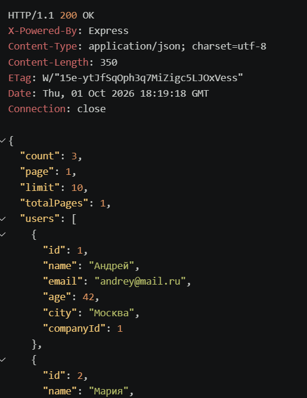

</details>

<details>
<summary><b>lab3-7. GET /users?sort=age&order=desc — сортировка по возрасту (убывание)</b></summary>

**Запрос:** `GET http://localhost:3000/users?sort=age&order=desc`

**Ожидаемый вывод:** `200 OK`, порядок: 67, 52, 45, 42, 34, 31, 28, 25

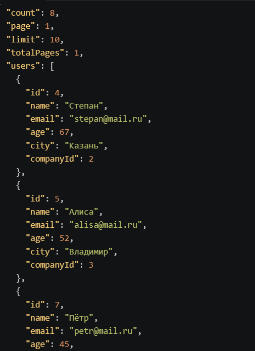

</details>

<details>
<summary><b>lab3-8. GET /users?page=2&limit=3 — пагинация</b></summary>

**Запрос:** `GET http://localhost:3000/users?page=2&limit=3`

**Ожидаемый вывод:** `200 OK`, `count: 8, page: 2, limit: 3, totalPages: 3`, 3 пользователя на странице

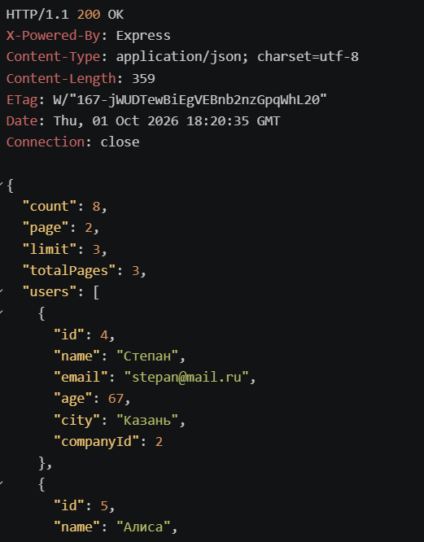

</details>

<details>
<summary><b>lab3-9. GET /users/stats — статистика по возрасту</b></summary>

**Запрос:** `GET http://localhost:3000/users/stats`

**Ожидаемый вывод:** `200 OK`, `{ count: 8, averageAge: 40.5, minAge: 25, maxAge: 67 }`

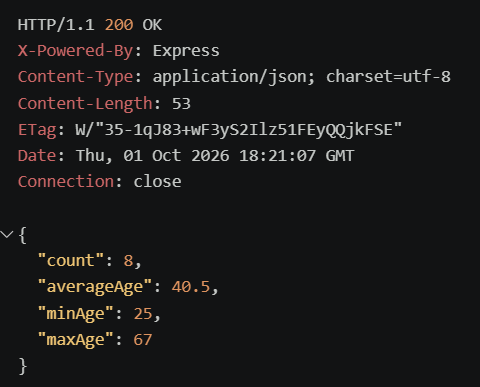

</details>

<details>
<summary><b>lab3-10. GET /cities/Москва/users — пользователи города (категория)</b></summary>

**Запрос:** `GET http://localhost:3000/cities/Москва/users`

**Ожидаемый вывод:** `200 OK`, `{ city: "Москва", count: 3, users: [...] }`

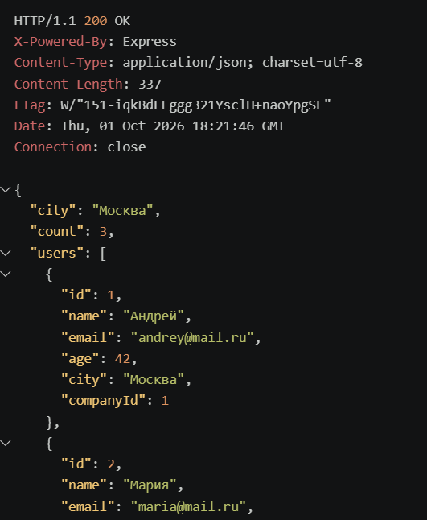

</details>

<details>
<summary><b>lab3-11. GET /companies/1/users — пользователи компании</b></summary>

**Запрос:** `GET http://localhost:3000/companies/1/users`

**Ожидаемый вывод:** `200 OK`, `{ company: "ТехноСофт", count: 3, users: [...] }`

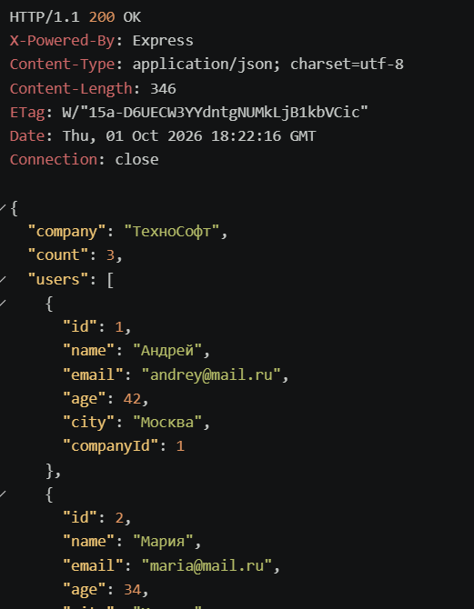

</details>

<details>
<summary><b>lab3-12. GET /users/abc — 400 Bad Request (невалидный id)</b></summary>

**Запрос:** `GET http://localhost:3000/users/abc`

**Ожидаемый вывод:** `400 Bad Request`, `{ error: "id должен быть натуральным числом" }`

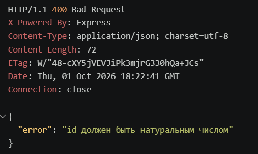

</details>

<details>
<summary><b>lab3-13. GET /users/999 — 404 Not Found</b></summary>

**Запрос:** `GET http://localhost:3000/users/999`

**Ожидаемый вывод:** `404 Not Found`, `{ error: "Пользователь не найден" }`

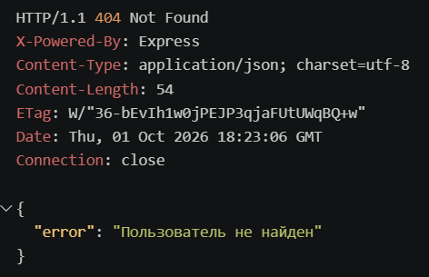

</details>

<details>
<summary><b>lab3-14. GET /users/1/posts/1/comments/3 — 404 (комментарий не под этим постом)</b></summary>

**Запрос:** `GET http://localhost:3000/users/1/posts/1/comments/3`

**Ожидаемый вывод:** `404 Not Found`, `{ error: "Под данным постом нет такого комментария" }`

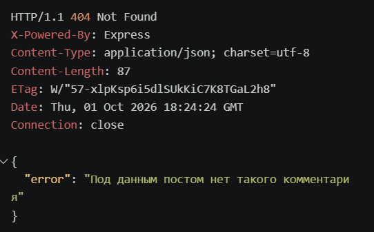

</details>

## Контрольные вопросы

<details>
<summary><b>Базовый уровень (1–10)</b></summary>

**1. Что такое маршрутизация? Как в Express/Flask?**
Сопоставление URL+метода с обработчиком. Express: `app.METHOD(PATH, HANDLER)`. Flask: `@app.route(...)`.

**2. Чем отличаются `req.params`, `req.query`, `req.body`?**
`params` — из пути `/users/42`. `query` — после `?` (`?age=20`). `body` — тело POST/PUT. Params и query — всегда строки.

**3. Как получить параметр пути?**
Express: `req.params.id`. Flask: аргумент функции (`<int:user_id>`).

**4. Что если не преобразовать параметр в число?**
Строка `"42"` не равна числу `42` при `===`. `find` не найдёт. 404 вместо результата.

**5. Как обработать отсутствие параметра?**
Маршрут не сработает → 404 от wildcard. Невалидный (не число) → 400.

**6. Что такое вложенные маршруты? Пример.**
Иерархия ресурсов: `/users/:userId/posts/:postId/comments/:commentId`.

**7. Код, если ресурс не найден?**
404.

**8. Код при невалидном параметре?**
400.

**9. Как объявить необязательный параметр пути?**
`/users/:id?` (Express 4.x+).

**10. Почему важен порядок маршрутов?**
Express сверху вниз. `/users/:id` раньше `/users/stats` — перехватит `stats` как id.

</details>

<details>
<summary><b>Средний уровень (11–19)</b></summary>

**11. Как получить query-параметры? Отличие от params?**
`req.query.key` (Express), `request.args.get()` (Flask). Строки. Params — идентификация, query — фильтр/сортировка/пагинация.

**12. Как задать значение по умолчанию для query?**
`parseInt(req.query.page) || 1`.

**13. Как искать по подстроке?**
`el.name.toLowerCase().includes(search.toLowerCase())`.

**14. Как сортировать по нескольким полям?**
Whitelist полей, компаратор по типу (`localeCompare` для строк, вычитание для чисел), `desc` — инвертировать знак.

**15. Пагинация с totalPages?**
`total = result.length` до slice. `skip = (page-1)*limit`. `slice(skip, skip+limit)`. `totalPages = Math.ceil(total/limit)`.

**16. Как валидировать query? Коды?**
Привести к числу, проверить диапазон/whitelist. Невалидно → 400.

**17. Как фильтровать по нескольким полям?**
`?filter=field:value` — по одному. Или несколько `&filter=...`, парсить каждое.

**18. Если параметр передан дважды (`?tag=js&tag=node`)?**
`req.query.tag` станет **массивом** `["js","node"]`.

**19. Как ограничить max limit?**
`if (limit > 100) return 400`.

</details>

<details>
<summary><b>Продвинутый уровень (20–29)</b></summary>

**20. Как комбинировать params и query?**
`GET /users/42/posts?sort=title&page=1` — оба работают одновременно.

**21. Вложенные маршруты с несколькими уровнями?**
Каскадная проверка: все id → существование каждой сущности → связи (`post.userId === userId`, `comment.postId === postId`).

**22. Wildcard-маршрут, почему последним?**
`app.use((req, res) => res.status(404)...)` — без пути. Express сверху вниз, поэтому **последним**.

**23. Глобальный обработчик ошибок?**
Middleware с **4 аргументами** `(err, req, res, next)`, после 404, до `listen`. `console.error` + `res.status(500).json(...)`.

**24. Логирование с IP?**
Middleware: `console.log(req.method, req.url, req.ip)` + `next()`.

**25. Защита от больших limit?**
Валидация `limit <= 100`, дефолт 10, иначе 400.

**26. Как реализовать статистику?**
Цикл/reduce: `count`, `sum`, `min`, `max`, `average`. Защита от `count === 0`.

**27. Как структурировать проект при росте?**
Роутеры (`express.Router()`), контроллеры, модели, middleware — по отдельным файлам.

**28. OpenAPI/Swagger для документации?**
YAML/JSON-описание эндпоинтов, параметров, ответов. Swagger UI рендерит из файла.

**29. Как тестировать маршруты с параметрами в Postman?**
Вставлять значения в URL, вкладка Params для query, коллекции + Environments для `{{baseUrl}}`.

</details>

## Вывод

В ходе лабораторной работы реализованы базовый, средний и продвинутый уровни API на Node.js + Express: CRUD-подобные эндпоинты с параметрами пути, query-параметры (поиск, фильтрация, сортировка, пагинация), вложенные маршруты с несколькими параметрами, wildcard-404, логирование с IP, статистика и глобальный обработчик ошибок. Освоены `req.params` vs `req.query`, `find` vs `filter`, `parseInt` vs `Number`, каскадная валидация связей. Главные трудности — порядок объявления маршрутов (`/users/stats` до `/users/:id`), парсинг `filter=field:value` и регистронезависимость при фильтрации.

---

## Список использованных источников

1. Express — Routing. URL: https://expressjs.com/en/guide/routing.html
2. Express — Request. URL: https://expressjs.com/en/4x/api.html#req
3. MDN Web Docs — HTTP методы. URL: https://developer.mozilla.org/ru/docs/Web/HTTP/Methods
4. MDN Web Docs — URL. URL: https://developer.mozilla.org/ru/docs/Learn/Common_questions/What_is_a_URL
5. REST API Tutorial. URL: https://restfulapi.net/
6. REST Client for VS Code. URL: https://marketplace.visualstudio.com/items?itemName=humao.rest-client